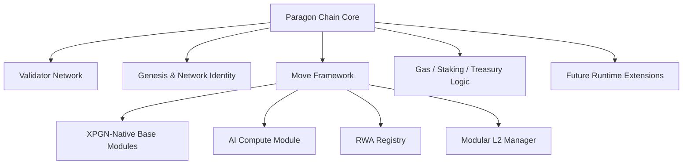

# Paragon Chain Core

**The sovereign Aptos-derived layer 1 repository for Paragon Chain.**

This is the chain-core foundation for Paragon's validator network, genesis, framework ownership, runtime customization, and long-term MoveVM-based L1 roadmap.

[Vision](#vision) • [Architecture](#architecture) • [What This Repo Owns](#what-this-repository-owns) • [Phased Roadmap](#phased-roadmap) • [Customization Surface](#customization-surface) • [Next Steps](#next-steps)

## Vision

Paragon Chain is being built as a high-performance, Aptos-derived MoveVM network designed for the next generation of onchain products.

The long-term goal is not just to launch another general-purpose chain, but to create a purpose-built L1 for:

- AI-native onchain coordination and settlement
- compliant real-world asset infrastructure
- modular L2 registration and fee alignment
- sustainable validator, treasury, and application economics
- scalable execution without sacrificing formal asset safety

The whitepaper direction for Paragon Chain centers around an Aptos-style parallel execution foundation, extended over time with chain-native modules for AI compute, RWA registry flows, modular roll-up settlement, and dynamic fee routing ([Paragon Chain Whitepaper v0.3](https://www.paragonchain.org/whitepaper)).

## What This Repository Is

`paragon-chain-core` is the sovereign chain repository.

It starts from an `aptos-core` fork because Paragon is building a real L1, not only a Move application deployed on top of another network.

This repository is where Paragon will own the parts of the system that must exist at chain level:

- validator and fullnode software
- genesis and network bootstrapping
- framework-level Move integration
- chain identity and network configuration
- gas, fee, staking, and treasury behavior that must be enforced natively
- future execution and storage divergence where the whitepaper requires more than app-level Move modules

## What This Repository Owns

| Layer | Responsibility |
| --- | --- |
| **Node** | Validator and fullnode binaries, networking, runtime entrypoints, and operational boot flow. |
| **Genesis** | Chain bootstrapping, framework publishing, initial validator set, and network identity. |
| **Framework** | Chain-native Move modules that belong in the base system rather than in standalone application repos. |
| **Economics** | Gas behavior, staking hooks, fee routing, validator incentives, and treasury-aligned configuration. |
| **Runtime Extensions** | Future Paragon-specific execution, storage, and settlement features that cannot be expressed in Move alone. |

## What This Repository Does Not Replace

This repo is foundational, but it is not meant to absorb every other Paragon codebase.

Separate repositories should still exist for:

- protocol contracts on EVM networks
- subgraphs and indexing surfaces
- frontend applications
- standalone Move packages not yet promoted into chain core
- infrastructure tooling that does not need to ship with the validator client

## Architecture

### Base foundation

Paragon Chain is being designed on top of an Aptos-derived architecture with:

- pipelined transaction processing
- BFT ordering in the Aptos/HotStuff family
- MoveVM execution
- Block-STM-style parallel transaction scheduling
- framework-governed upgrade paths

This gives Paragon a strong starting point for throughput, safety, and framework-level programmability while still allowing long-term divergence where the chain needs to become uniquely Paragon.

### Target extension areas

The whitepaper direction highlights four major extension zones:

| Zone | Long-term objective |
| --- | --- |
| **AI Compute** | Native escrow, coordination, proof, and settlement rails for inference and training jobs. |
| **RWA Registry** | Move-based registry and compliance framework for tokenized real-world assets. |
| **Modular L2 Manager** | Registration, bridging, settlement alignment, and fee-sharing for Paragon-aligned rollups and sidechains. |
| **Dynamic Revenue Routing** | Chain-level fee logic that can align validators, treasury, and ecosystem incentives over time. |

## Architecture At A Glance

## Why Aptos-Derived

Aptos is a strong base for Paragon because it already provides the foundations that matter most for the first stage of this L1:

- Move-based asset safety and composability
- high-throughput parallel execution design
- framework-governed upgrade patterns
- validator-grade node and network architecture
- a realistic path from local devnet to public testnet and eventually mainnet

That said, not every whitepaper feature is “just Move.”

Some future goals will live naturally in framework modules, while others will require deeper changes in execution, storage, networking, or genesis composition. This repository exists so Paragon can own that full stack when needed.

## Repository Areas

| Area | Purpose |
| --- | --- |
| `aptos-node/` | Node binary entrypoint and runtime wiring |
| `aptos-move/framework/` | Core Move framework packages and future Paragon-native modules |
| `aptos-move/vm-genesis/` | Genesis building and framework publishing logic |
| `config/` | Validator, node, and network configuration surfaces |
| `consensus/` | Consensus behavior and validator coordination |
| `execution/` | Block execution pipeline and runtime integration |
| `mempool/` | Transaction admission and propagation behavior |
| `storage/` | State storage and future data-layer customization |
| `sdk/` | Client and integration support for Paragon chain consumers |

## Phased Roadmap

Paragon Chain should not try to become its final form in one jump. The correct path is phased and explicit.

### Phase 0: Fork Hygiene

- establish Paragon-specific documentation and ownership
- preserve clear upstream boundaries with Aptos
- define fork strategy and repo purpose

### Phase 1: Identity And Devnet Baseline

- Paragon chain naming and local network identity
- deterministic Paragon genesis flow
- first local validator and fullnode setup
- XPGN naming strategy at chain level

### Phase 2: Framework And Economics Layer

- XPGN-native gas and staking direction
- fee-routing and treasury-aligned economics
- governance and capability layout for long-term operation
- genesis publication strategy for Paragon-native modules

### Phase 3: Paragon Framework Modules

- AI compute primitives
- RWA registry primitives
- modular L2 registry and settlement primitives
- treasury and governance helpers that belong in chain core

### Phase 4: Advanced Runtime Differentiation

- deeper execution customizations
- storage and settlement enhancements
- whitepaper-driven runtime features that require more than Move modules

For the working implementation path, see:

- [Paragon Fork Roadmap](./docs/PARAGON_FORK_ROADMAP.md)
- [Chain Customization Map](./docs/CHAIN_CUSTOMIZATION_MAP.md)

## Customization Surface

The most important design rule for this fork is simple:

**do not change Rust core code unless the feature truly cannot be done in framework Move, genesis composition, or config.**

### First safe targets

- `aptos-move/framework/`
- `aptos-move/vm-genesis/`
- `config/`
- local run and network bootstrap surfaces

### Later, higher-risk targets

- `execution/`
- `aptos-move/aptos-vm/`
- `mempool/`
- `storage/`
- deeper consensus/runtime paths

This keeps the first Paragon devnet practical and auditable while still preserving room for major chain differentiation later.

## Near-Term Outcome

The immediate milestone for this repository is not “finish the whitepaper.”

It is:

- stand up a real Paragon fork baseline
- prove the chain can run under Paragon identity
- prepare XPGN-native framework ownership
- establish the path from local devnet to public testnet

That is the foundation the future chain is built on.

## Upstream Relationship

This repository starts from `aptos-core`, and that relationship should remain explicit.

Best practice for the fork:

- keep upstream sync manageable
- isolate Paragon-specific changes clearly
- document every meaningful divergence
- avoid mixing speculative research work into the first network milestone

## Current Status

- Aptos core foundation cloned into the Paragon workspace
- Paragon fork documentation and architecture framing in place
- first implementation targets mapped for genesis, framework, config, and economics work
- next milestone: Phase 1 identity and devnet baseline

## Next Steps

1. Connect this fork to the `Paragon-Chain/paragon-chain-core` GitHub repo with `origin`, while preserving Aptos as `upstream`.
2. Define Paragon chain naming, chain ID, and local network identity.
3. Map the exact genesis and framework release entrypoints for Paragon-native bootstrapping.
4. Design the first XPGN-native chain ownership model.
5. Stand up the first Paragon devnet runbook.

## Long-Term Direction

Paragon Chain is meant to become more than a fork. It is meant to become the execution and settlement base for a broader ecosystem spanning DeFi, AI, RWAs, and modular chain infrastructure.

This repository is where that future becomes concrete.
